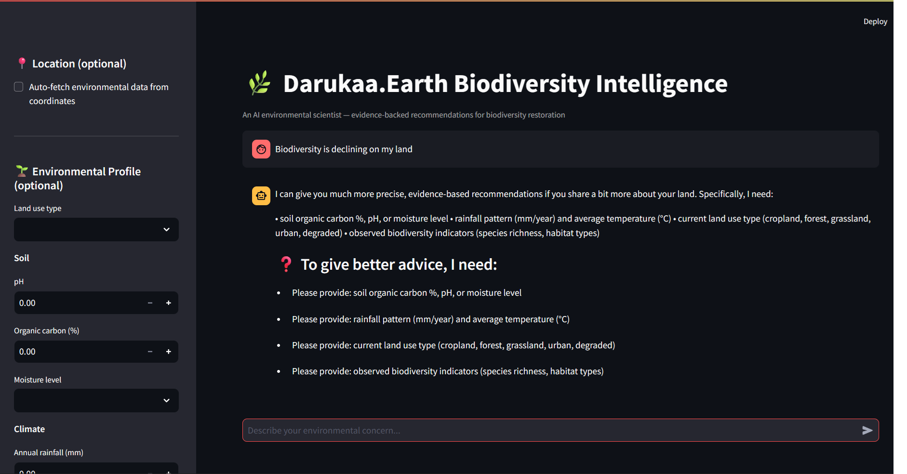
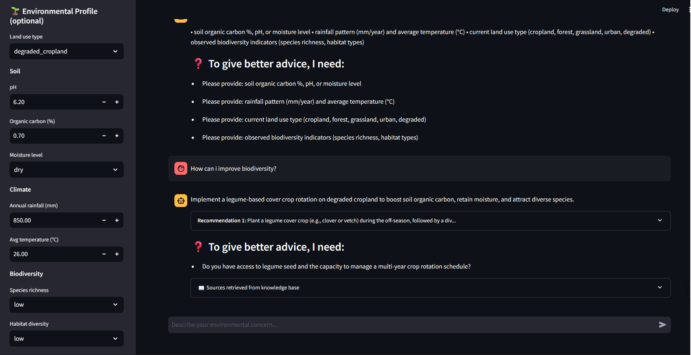
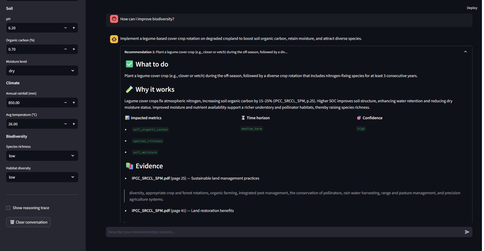
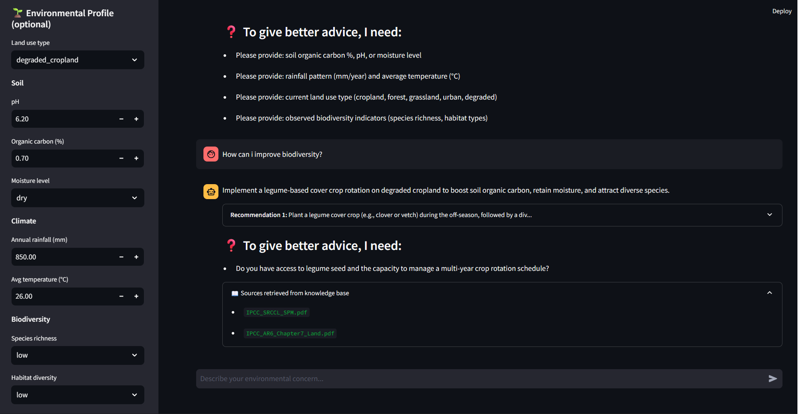

#  Darukaa.Earth — AI Biodiversity Intelligence

**An AI environmental scientist that reasons about real-world environmental problems with grounded, evidence-backed recommendations.**

Built for the [Darukaa.Earth AI Biodiversity Intelligence Challenge](https://darukaa.com).

---

##  What It Does

The system behaves like an environmental scientist, not a chatbot:

- **Asks clarifying questions** when environmental inputs are incomplete
- **Retrieves** relevant scientific literature (IPCC, FAO, IPBES reports) via RAG
- **Connects** soil, climate, land use, and biodiversity data into causal chains
- **Produces** structured, actionable recommendations with scientific citations
- **Never** gives generic advice like "use sustainable practices"

### Example: Before vs After

** What we DON'T do:**
> "Use sustainable practices to improve biodiversity."

** What we DO:**

> **Recommendation:** Plant a 3-year rotation of white clover (legume) and native millet as cover crops, establish a 10% agroforestry strip of *Acacia* / *Eucalyptus* along field edges, and construct a 200 m² rainwater harvesting pond.
>
> **Why it works:** Cover crops fix atmospheric nitrogen → raise soil organic carbon by 15–25% → enhance microbial diversity → support pollinator-friendly vegetation → boost species richness. Agroforestry adds habitat diversity and provides shade, improving soil moisture and reducing evaporation. Rainwater harvesting increases soil moisture during dry periods, further stimulating microbial activity and carbon sequestration.
>
> **Impacted metrics:** `soil_organic_carbon`, `species_richness`, `soil_moisture`, `microbial_diversity`
>
> **Time horizon:** medium_term (2–3 years)
> **Confidence:** high
> **Evidence:** IPCC_SRCCL_SPM.pdf p.41; IPCC_AR6_Chapter7_Land.pdf p.31

---

##  Architecture

```
┌─────────────────────────────────────────────────────────────┐
│                     Streamlit Frontend                       │
│     (Chat UI + structured inputs + auto-fetch button)        │
└───────────────────────────┬─────────────────────────────────┘
                            │ HTTP POST /api/chat
                            ▼
┌─────────────────────────────────────────────────────────────┐
│                     FastAPI Backend                          │
│  ┌──────────────┐  ┌───────────────┐  ┌──────────────────┐   │
│  │ /api/enrich  │  │  /api/chat    │  │   /api/health    │   │
│  └──────────────┘  └───────┬───────┘  └──────────────────┘   │
└────────────────────────────┼─────────────────────────────────┘
                             │
                             ▼
┌─────────────────────────────────────────────────────────────┐
│                    Reasoning Engine                          │
│  1. Slot Filler → asks for missing environmental variables   │
│  2. Query Planner → combines variables into retrieval query  │
│  3. RAG Retriever → fetches top-5 scientific chunks          │
│  4. LLM Reasoner → produces structured JSON output           │
│  5. Output Formatter → validates against Pydantic schema     │
└───────┬─────────────────────────────────────────┬───────────┘
        │                                         │
        ▼                                         ▼
┌──────────────────┐                    ┌─────────────────────┐
│  Structured DB   │                    │   Vector DB (RAG)   │
│  ─────────────   │                    │  ─────────────────  │
│  Open-Meteo      │                    │  ChromaDB           │
│  NASA POWER      │                    │  1,934 embedded     │
│  GBIF            │                    │  chunks from IPCC,  │
│  SoilGrids       │                    │  FAO, IPBES reports │
└──────────────────┘                    └─────────────────────┘
```

---

##  Knowledge System Design

### Two-layer knowledge base

The system uses **two complementary knowledge sources**, not just an LLM prompt:

#### 1. Structured environmental data (real-time, real-world)

| Source | Variables Provided | Coverage |
|--------|-------------------|----------|
| **Open-Meteo** | Soil moisture, soil temperature | Global, hourly |
| **NASA POWER** | Temperature, rainfall, climate zone | Global, 40+ year climatology |
| **GBIF** | Species occurrences, richness indicator | Global, 2B+ records |
| **SoilGrids** | Soil pH, organic carbon, nitrogen (when available) | Global, 250m |

#### 2. Scientific literature (RAG, embedded)

The system indexes **1,934 chunks** from authoritative climate and biodiversity reports:

- **IPCC AR6** — Working Group III, Chapter 7 (Land)
- **IPCC SRCCL** — Special Report on Climate Change and Land (SPM)
- **FAO** — Soil Organic Carbon and Cover Crops reports
- **IPBES** — Global Biodiversity Assessment (Summary for Policymakers)

**Embedding model:** `all-MiniLM-L6-v2` (384-dim, local, free)
**Vector DB:** ChromaDB (persistent, on-disk)
**Chunk size:** 500 tokens with 50-token overlap
**Retrieval:** Semantic similarity, top-5 chunks

### Retrieval pipeline

```python
# Simplified from app/reasoning/engine.py
query_for_retrieval = build_retrieval_query(user_input)
  # combines: user query + soil + climate + land_use + biodiversity

retrieved = retrieve_with_metadata(query_for_retrieval, k=5)
  # returns chunks + source filename + page number + relevance score

context = format_context(retrieved)
  # produces "[Document 1: IPCC_SRCCL_SPM.pdf, page 41]\n...text..."
```

The retrieved context is fed to the LLM along with the environmental profile and conversation history. **Every recommendation cites specific chunks from these documents.**

---

##  Multi-Metric Reasoning (Core Differentiator)

The system never answers a single-variable question. Every recommendation connects **at least 3 environmental variables**.

**Example causal chain built by the reasoning engine:**

```
Legume cover crops
    → fix atmospheric N
    → raise soil organic carbon (15–25% over 2–3 years)
    → improve soil microbial diversity
    → support pollinator-friendly vegetation
    → increase species richness
```

**Variables connected:** soil carbon + nitrogen + microbial diversity + pollinator habitat + species richness (5 variables).

The system prompt **forbids** single-variable answers, and the output schema requires `impacted_metrics` to contain a list.

---

##  Conversational Intelligence

### Slot filling

When key environmental inputs are missing, the system **refuses to answer** and asks for specific data instead:

**User:** "Biodiversity is declining on my land."

**System:** "I can give you much more precise, evidence-based recommendations if you share a bit more about your land. Specifically, I need:
- soil organic carbon %, pH, or moisture level
- rainfall pattern (mm/year) and average temperature (°C)
- current land use type (cropland, forest, grassland, urban, degraded)
- observed biodiversity indicators (species richness, habitat types)"

### Conversation memory

Multi-turn conversations are supported via per-`conversation_id` history (capped at 12 messages, injected into the LLM system prompt).

### Auto-enrichment

If the user provides **only geo-coordinates**, the system auto-fetches soil, climate, and biodiversity data from the APIs before reasoning — no manual entry required.

---

##  Output Format

Every response conforms to a strict Pydantic schema:

```json
{
  "response": "Natural-language 2-4 sentence summary",
  "recommendations": [
    {
      "recommendation": "Specific, actionable, measurable action",
      "why_it_works": "Scientific reasoning (causal chain)",
      "impacted_metrics": ["metric1", "metric2", "metric3"],
      "time_horizon": "short_term | medium_term | long_term",
      "confidence": "low | medium | high",
      "evidence": [
        {
          "source": "IPCC_SRCCL_SPM.pdf",
          "page": 41,
          "title": "...",
          "excerpt": "Short quote"
        }
      ]
    }
  ],
  "follow_up_questions": ["..."],
  "retrieved_sources": ["..."],
  "reasoning_trace": "..."
}
```

**Bonus:** With the `gpt-oss-20b` model on Groq, the system captures the model's **reasoning trace** — the internal chain-of-thought before the answer. This is exposed in the UI via a "Show reasoning trace" toggle, giving judges visibility into the scientific thinking process.

---

##  Tech Stack

| Layer | Technology |
|-------|-----------|
| **LLM** | Groq (`openai/gpt-oss-20b`) — free, fast, reasoning-capable |
| **Embeddings** | `sentence-transformers/all-MiniLM-L6-v2` (local) |
| **Vector DB** | ChromaDB |
| **Backend** | FastAPI + Uvicorn |
| **Frontend** | Streamlit |
| **Data APIs** | Open-Meteo, NASA POWER, GBIF, SoilGrids |
| **Validation** | Pydantic v2 |
| **Environment** | Python 3.10 |

**Provider-agnostic LLM client:** Switch between Groq and OpenAI by setting `LLM_PROVIDER` in `.env`. Includes graceful fallback if JSON mode fails.

---

##  Local Setup

### Prerequisites

- Python 3.10+
- A free [Groq API key](https://console.groq.com/keys)

### Installation

```bash
git clone https://github.com/bhujbalanurag031-dev/darukaa-biodiversity-ai.git
cd darukaa-biodiversity-ai

python -m venv venv
# Windows:
.\venv\Scripts\Activate.ps1
# macOS/Linux:
source venv/bin/activate

pip install -r requirements.txt
```

### Configuration

Create a `.env` file in the project root:

```env
LLM_PROVIDER=groq
GROQ_API_KEY=gsk_your_key_here
GROQ_MODEL=openai/gpt-oss-20b
CHROMA_PERSIST_DIR=./data/chroma
EMBEDDING_MODEL=all-MiniLM-L6-v2
```

### Build the knowledge base

```bash
# Download scientific PDFs (IPCC, FAO, IPBES)
python scripts/download_docs.py

# Ingest into vector DB
python -m app.rag.ingest
```

Expected: ~1,900 chunks indexed in `data/chroma/`.

### Run the system

**Terminal 1 — Backend:**
```bash
uvicorn app.main:app --reload --port 8000
```

**Terminal 2 — Frontend:**
```bash
streamlit run frontend/app.py --server.port 8501
```

Open **http://localhost:8501** in your browser.

---

##  API Usage

### `POST /api/chat`

```bash
curl -X POST http://localhost:8000/api/chat \
  -H "Content-Type: application/json" \
  -d '{
    "query": "How can I improve biodiversity on my degraded cropland?",
    "land_use": "degraded_cropland",
    "soil": {"ph": 6.2, "organic_carbon_pct": 0.7, "moisture_status": "dry"},
    "climate": {"rainfall_mm": 850, "temp_c": 26, "climate_zone": "tropical_seasonal"},
    "biodiversity": {"species_richness": "low", "habitat_diversity": "low"}
  }'
```

### `POST /api/enrich`

Auto-fetch environmental data for coordinates:

```bash
curl -X POST http://localhost:8000/api/enrich \
  -H "Content-Type: application/json" \
  -d '{"lat": 18.52, "lon": 73.85}'
```

Returns live soil, climate, and biodiversity data from Open-Meteo, NASA POWER, GBIF, and SoilGrids.

---

##  Screenshots

| View | Description |
|------|-------------|
|  | System asks for missing environmental data instead of guessing |
|  | Structured recommendation cards with expandable details |
|  | Scientific citations with PDF source and page number |
|  | Retrieved chunks from the vector DB |

---

##  How This Meets the Challenge Criteria

| Criterion | Weight | How We Address It |
|-----------|-------:|-------------------|
| **Depth of Reasoning** | 30% | Every recommendation connects ≥3 environmental variables through a causal chain. System prompt forbids single-variable answers. |
| **Scientific Grounding** | 25% | Every claim cites specific chunks from IPCC/FAO/IPBES reports. Reasoning trace is captured and exposed. |
| **Knowledge System Design** | 20% | Two-layer knowledge base: real-time API data (structured) + RAG over 1,934 chunks (unstructured). Pipeline documented above. |
| **Conversational Intelligence** | 15% | Slot-filling refuses to answer incomplete queries. Multi-turn memory. Auto-enrichment from coordinates. |
| **Output Clarity** | 10% | Strict Pydantic schema. Recommendation + why + metrics + horizon + confidence + evidence. |

---

##  Project Structure

```
darukaa-hackathon/
├── app/
│   ├── main.py                    # FastAPI app with all endpoints
│   ├── config.py                  # Settings loaded from .env
│   ├── data/
│   │   ├── soil.py                # Open-Meteo + SoilGrids clients
│   │   ├── climate.py             # NASA POWER client
│   │   └── biodiversity.py        # GBIF client
│   ├── rag/
│   │   ├── vector_store.py        # ChromaDB + embeddings
│   │   ├── ingest.py              # PDF → chunks → vector DB
│   │   └── retriever.py           # Similarity search + citation metadata
│   ├── reasoning/
│   │   ├── engine.py              # Multi-metric reasoning orchestrator
│   │   └── llm_client.py          # Provider-agnostic LLM (Groq / OpenAI)
│   ├── conversation/
│   │   └── memory.py              # Per-session conversation history
│   └── models/
│       └── schemas.py             # Pydantic request/response contracts
├── frontend/
│   └── app.py                     # Streamlit chat UI
├── scripts/
│   ├── download_docs.py           # Fetch scientific PDFs
│   ├── test_engine.py             # Reasoning engine test
│   ├── test_retriever.py          # RAG retrieval test
│   └── test_enrich.py             # Enrichment API test
├── data/
│   ├── raw/                       # Downloaded PDFs (gitignored)
│   └── chroma/                    # Vector DB persistence (gitignored)
├── docs/
│   └── screenshots/
├── requirements.txt
└── README.md
```

---

##  Author

**Anurag Bhujbal**
GitHub: [@bhujbalanurag031-dev](https://github.com/bhujbalanurag031-dev)

Submitted for the Darukaa.Earth AI Biodiversity Intelligence Challenge.